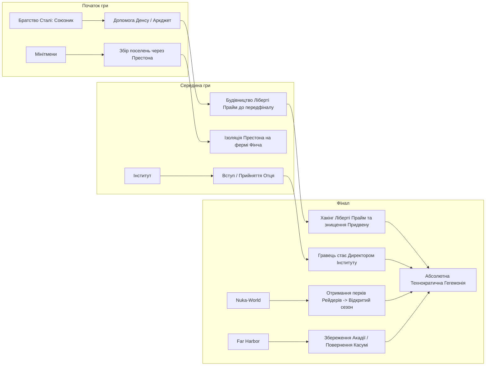

# Геополітична Дорожня Карта Фракцій («The Machiavellian Roadmap»)

> **Джерело аналізу:** Документ `Gemeni fallaut chat` (політичні рішення щодо Інституту, Братства Сталі, Far Harbor та Ядер-Світу).

---

## 1. Геополітична Шахівниця Співдружності

Стратегія гравця полягає у послідовній побудові **технократичної монополії Інституту** з прагматичним використанням та подальшою ліквідацією суперників.



---

## 2. Інститут: Шлях від Синта-агента до Директора

Гравець обирає Інститут як єдину наукову опору майбутнього людства:

1. **Особисті апартаменти Директора:**
   - Після завершення сюжету та смерті Шона гравець отримує повний доступ до кімнати Директора (на верхньому ярусі з персональним ліфтом).
2. **Взаємодія з керівниками підрозділів:**
   - **Доктор Еллі Філлмор (Facilities / Інфраструктура):** ключовий союзник при забезпеченні живлення Інституту (квест *Mass Fusion*).
   - **Доктор Айзек Карлін (Bioscience / Біотехнології):** запуск циклічних місій на збір зразків та дослідження ферм (*Building a Better Crop* на фермі Ворвіків).
   - **Служба повернення синтів (SRB):** квести на нейтралізацію загрози бунтівників.
3. **Публічна політика в Даймонд-сіті:**
   - Оголошення нової, відкритої політики Інституту через радіостанцію.
   - Поява патрулів синтів першого та другого поколінь на вулицях міст та військових блокпостах Співдружності для підтримання порядку.
   - Придбання квартири **Неон Флетс (Neon Flats)** у Даймонд-сіті як зовнішньої резиденції високого класу.

---

## 3. Братство Сталі: Прагматична Утилізація

Гравець реалізував блискучу макіавеллівську комбінацію:

- **Крок 1 (Використання інженерної бази):** Виконання початкових завдань Паладина Денса (Аркджет, поліцейська дільниця Кембриджа), вступ до Братства, участь у розвідці та збірці гігантського бойового робота **Ліберті Прайм (Liberty Prime)**.
- **Крок 2 (Зупинка перед точкою неповернення):** Гравець навмисно зупиняє співпрацю на передостанньому етапі будівництва, не допускаючи активації робота проти Інституту.
- **Крок 3 (Перехоплення контролю та ліквідація):** Під час фінального штурму Інститут запускає вірус у системи Ліберті Прайм, робот знищує дирижабль «Придвен».
- **Крок 4 (Зачистка Бостонського аеропорту):** Повне знищення залишків експедиційного корпусу Мексона. Аеропорт перетворюється на укріплений форпост Інституту із захистом 84+.

---

## 4. Far Harbor: Дипломатичний Технократичний Баланс

На острові гравець відмовився від радикального фанатизму на користь збереження стабільності:

1. **Родина Накано:**
   - Повне розслідування справи Касумі Накано.
   - Виконання ланцюжка завдань *«Ідеали Акадії»* та збереження нейтралітету.
   - Касумі переконана повернутися додому до батьків неушкодженою.
2. **Акадія (Acadia) та синти:**
   - Збереження Акадії як науково-дослідного центру автономних синтів.
   - Відмова від передачі координат Акадії Братству Сталі.
3. **Місто Фар Харбор та Діти Атома:**
   - Виконання завдань мешканців міста для максимальної підтримки.
   - Запобігання знищенню конденсаторів туману.
   - Проходження квесту *«Смерть мозку» (Brain Dead)* у Сховищі 118: детективне викриття злочинця серед робомозків, отримання унікального капелюха *The Dapper Gent* (+2 CHR).
4. **Броня морпіха (Marine Armor):**
   - Розкриття спогадів ДіМи, знаходження всіх підводних контейнерів уздовж узбережжя, збірка найпотужнішого несилового бронекостюма у грі.
5. **Логістика острова:**
   - Відкриття майстерні у халупі Старого Лонгфелло, прокладання лінії постачання безпосередньо з материкової Співдружності.

---

## 5. Nuka-World: «Рейдерський Гамбіт» та Операція «Відкритий Сезон»

Гравець розробив тонкий план експлуатації рейдерських механік:

```
[Захоплення 5 парків Ядер-Світу]
           │
           ▼
[Розподіл парків: Оператори (2) + Адепти (2) + Зграя (1)]
           │
           ▼
[Створення 3 васалів (без дітей) + 3 аванпостів (порожні землі)]
           │
           ▼
[Отримання топових перків: "Ас-оператор" + "Обраний адепт"]
           │
           ▼
[ОПЕРАЦІЯ "ВІДКРИТИЙ СЕЗОН": Ліквідація ватажків рейдерів]
           │
           ▼
[Збереження скринь данини, ринку торговців та цивільний порядок]
```

### Чому була пожертвувана «Зграя» (The Pack)?
Перк Зграї *«Альфа-самець»* дає опір шкоді при бійках без броні. Оскільки гравець використовує важку броню X-02 та снайперський стелс, цей перк був технічно непотрібним. Перки Операторів (бонус до шкоди з глушником) та Адептів (відновлення Очок Дії) виявилися ідеальними для білда.
