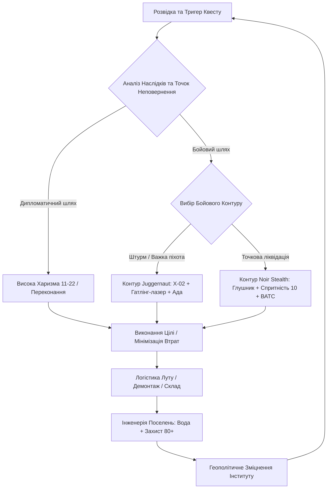

# Фундаментальна модель взаємодії з Fallout 4 («The Hands-on Architect Model»)

> **Джерело аналізу:** Документ `Gemeni fallaut chat.docx` (111 сесій взаємодії, хронологія липень–серпень 2026).  
> **Мета:** Формалізація системного підходу до гри, взаємодії з механіками, фракціями, економікою та AI-асистентом.

---

## 1. Концепція та Філософія Моделі

Модель **«Hands-on Architect»** базується на трансформації постапокаліптичного виживання у керовану, високотехнологічну інженерно-політичну систему. На відміну від стандартного підходу «блукаючого одинака» чи хаотичного стрільця, гравець діє як **головний інженер, логіст і верховний правитель Співдружності**.

### Ключові принципи моделі:
1. **Технократичний інституціоналізм:** Інститут розглядається як єдина легітимна науково-виробнича сила, здатна відновити цивілізацію. Гравець інтегрується в нього, досягає посади Директора та використовує його потенціал.
2. **Нульова толерантність до паразитизму:** Усі поселення оптимізуються. Мінітмени та Престон Гарві використовуються для стартового збору поселень, після чого ізолюються (ферма Фінча), поступаючись автоматизованій мережі.
3. **Економічна гегемонія «Водяного Барона»:** Капітал у 80,000+ кришок створюється через індустріальні станції очищення води, що дозволяє викуповувати всі унікальні легендарні предмети на ринку без гринда.
4. **Конструктивна безпека (Tower Defense):** Автоматизована ешелонована оборона (турелі + ракети на штучних платформах) мінімізує необхідність особистої присутності гравця при нападах.
5. **Гуманізм через технології:** Категорична відмова від експлуатації людей (як у Сховищі 88), стандартизація побуту, уніформи та максимальне підняття настрою мешканців.

---

## 2. Системний Ігровий Цикл (Gameplay Interaction Loop)

Модель взаємодії розділена на 5 взаємопов'язаних фаз:

### Фаза I: Стратегічне планування та розвідка
- **Аналіз передумов:** перед входом у локацію чи взяттям квесту з'ясовується наявність точок неповернення (Points of No Return) для союзних фракцій.
- **Підготовка спорядження:** перевірка запасу ядерних блоків (підтримується стабільний пул 70+ блоків), хімії (Виноградні ментати для переговорів, Психо-винт для кризових зіткнень).
- **Підбір компаньйона:** 
  - Бойові рейди: модернізована **Ада** (штурмотронсько-сенсорна платформа з колосальною вогневою міццю).
  - Сюжетно-дослідницькі місії: **Кюрі** (романтична лінія, гуманізація синта) або **Старий Лонгфелло** (Фар Харбор).

### Фаза II: Тактична дія (Двоконтурна доктрина)
- **Контур A (Важкий штурм):** Силова броня (T-51b -> T-60 -> X-02 у білій інститутській модифікації) + Гатлінг-лазер. Пряме придушення чисельних сил супротивника (наприклад, атака на аеропорт чи патрулі Братства Сталі).
- **Контур B (Нуар-інфільтрація):** Легкий цивільний / модифікований одяг (Військова форма, Затінена полімерна бойова броня, Циліндр Освальда / Джентльменський казанок) + снайперський карабін або карабін з глушником (The Problem Solver / Splattercannon). Безшумна ліквідація ключових цілей (епізод у «Третьому рейку» у Добросусідстві).

### Фаза III: Логістика, Скрап та Складування
- Кожне повернення з рейду супроводжується скиданням матеріалів у центральний хаб або вузлову майстерню.
- Використання ліній постачання («Місцевий лідер», ранг 2) для об'єднання всіх верстаків Співдружності та Far Harbor в єдиний матеріальний пул.
- Постійне поповнення критичних рідкісних компонентів: алюміній, ядерний матеріал, оптичне волокно, мідь, шестерні.

### Фаза IV: Інфраструктурне масштабування
- Будівництво промислових очищувачів води (генерація надлишку >1000 од. води у вузлових точках).
- Зведення захисних модульних веж: генератори закріплюються у низьких захисних бетонних/дерев'яних коробах під вежею, щоб не обмежувати сектор вогню турелей верхнього ярусу.
- Призначення поселенців: чіткий поділ на фермерів (мультифрукт = 1 од. їжі на людину) та стаціонарних торговців 3-го рівня.

### Фаза V: Фракційний баланс та мета-прогресія
- Балансування відносин: використання циклічних квестів фракцій для отримання унікальних креслень і перків.
- Кульмінація зачистки: утилізація Братства Сталі після завершення будівництва Ліберті Прайм; витіснення/ліквідація ватажків рейдерів Ядер-Світу після отримання їхніх перків.

---

## 3. Матриця Станів Гравця (Player State Machine)

| Стан (State) | Мета стану | Екіпірування | Активний напарник | Ключові дії |
| :--- | :--- | :--- | :--- | :--- |
| **STATE_BASE_BUILDER** | Будівництво, електрифікація, розподіл ліній постачання | Одяг на харизму (+інтелект), захист не важливий | Відсутній або поселенці | Розстановка очищувачів, захисних веж, торгових точок, спальних місць |
| **STATE_DIPLOMAT_TRADER** | Торгівля, переговори, сюжетні переконання | Казанок/Циліндр, Окуляри лаборанта, Костюм (+CHR), Ментати | Кюрі | Досягнення CHR 16–22; скупка легендарок, максимальна ціна продажу води |
| **STATE_JUGGERNAUT_ASSAULT** | Зачистка укріплених баз (Корвега, Аеропорт, Лігво рейдерів) | X-02 Power Armor + Гатлінг-лазер + Ядерні блоки | Ада (Штурмотрон) | Танкування прямої шкоди, розпил броньованих лицарів та легендарних ворогів |
| **STATE_NOIR_ASSASSIN** | Точкова ліквідація цілей без шуму та паніки свідків | Затінена броня, форма солдата, глушники, ВАТС | Одинак або прихований компаньйон | Постріли з прихованого положення, хедшоти через прольоти сходів, швидкий вихід |
| **STATE_ROBOTICIST_ENGINEER** | Збірка, тюнінг роботів, хакінг штурмотронів | Робототехнічний костюм, карабін | Ада | Робота на верстаті роботів, злам протоколів ворожих машин, підрив заліза |

---

## 4. Протокол Взаємодії з AI-Асистентом (AI-Copilot Protocol)

На основі аналізу запитань користувача у щоденнику розроблено стандарт взаємодії між гравцем та штучним інтелектом-помічником:

1. **Інженерна конкретика:** Відповідь повинна містити точні координати, назви локацій двома мовами (оригінальна англійська + кирилична локалізація), рівневі вимоги та формули.
2. **Превентивне попередження про точки неповернення:** Обов'язкове попередження про те, який діалог чи здача квесту робить ворожою конкретну фракцію (наприклад, квести *Tactical Thinking*, *Mass Fusion*, *Spoils of War*).
3. **Оптимізація без руйнування лору:** Пропозиція рішень, що поєднують ігрову вигоду (найкращі перки/дроп) з естетикою порядку та роллю Директора Інституту.
4. **Усунення ігрових багів:** Надання чітких алгоритмів обходу відомих багів (глюки з текстурами броні, зависання спавну ключів, скрипти поселень).

---

## 5. Стандартизований Протокол Взаємодії з fallout4map.com

Для запобігання візуальному перевантаженню та неефективному хаотичному пошуку встановлюються правила роботи з інтерактивною картою:

### А. Робота виключно з нативними фільтрами меню MapGenie:
Використовуються суворо фіксовані ID категорій, перевірені в структурі рушія карти:
* **`cat=2680` (Unique Enemy):** 31 ключовий ватажок та бос гри (база для фарму важкої броні та легендарок).
* **`cat=2587` (Bobblehead):** 20 пупсів Волт-Тек (статистичні бонуси S.P.E.C.I.A.L.).
* **`cat=2589` (Perk Magazine):** 131 журнал (постійні перки на шкоду, торгівлю, захист).
* **`cat=2595` (Power Armor):** 57 точок спавну екзоскелетів і комплектів.
* **`cat=2596` (Fusion Core):** 110 генераторів ядерних блоків.
* **`cat=2674` (Key/Password):** 110 критичних ключів і паролів від закритих складів і терміналів.
* **`cat=2648` (Large Settlement):** ключові майстерні для розбудови ліній забезпечення.

### Б. Інтеграція під-карт DLC на fallout4map.com (Nuka-World та Far Harbor):
Сайт `fallout4map.com` містить усі три ключові простори гри як окремі незалежні карти:
* **Головна карта (Співдружність):** `https://fallout4map.com/`
* **Карта Far Harbor:** `https://fallout4map.com/far-harbor`
* **Карта Nuka-World:** `https://fallout4map.com/nuka-world`

#### Специфічні нативні фільтри Nuka-World (`fallout4map.com/nuka-world`):
* **`cat=2682` (Star Core):** Зоряні ядра для квесту «Стар-контроль» (Quantum X-01 Power Armor).
  * Пряме посилання: `https://fallout4map.com/nuka-world?cat=2682`
* **`cat=2683` (Hidden Cappy):** 10 прихованих графіті Кеппі для квесту в окулярах Сьєри Петрової (*Cappy in a Haystack*).
  * Пряме посилання: `https://fallout4map.com/nuka-world?cat=2683`
* **`cat=2679` (Recipe):** 21 рецепт ексклюзивних міксів Ядер-Коли.
* **`cat=2589` (Perk Magazine):** 5 унікальних випусків журналу *SCAV!* (перки на шкоду та харизму).
* **`cat=2595` (Power Armor):** 10 точок розміщення комплектів силової броні в парку.

